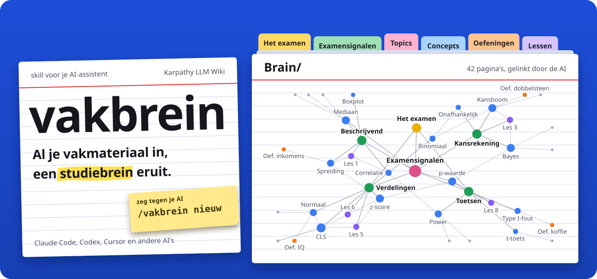
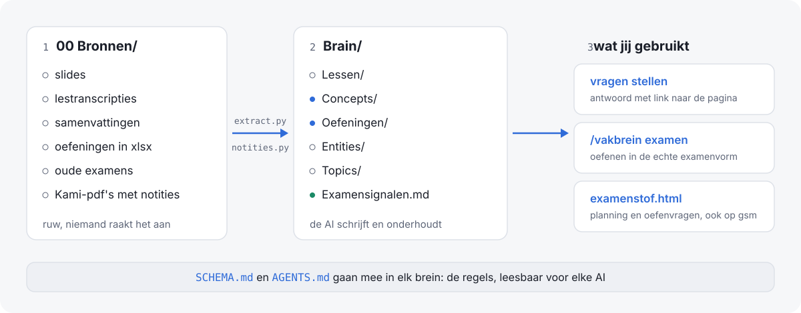
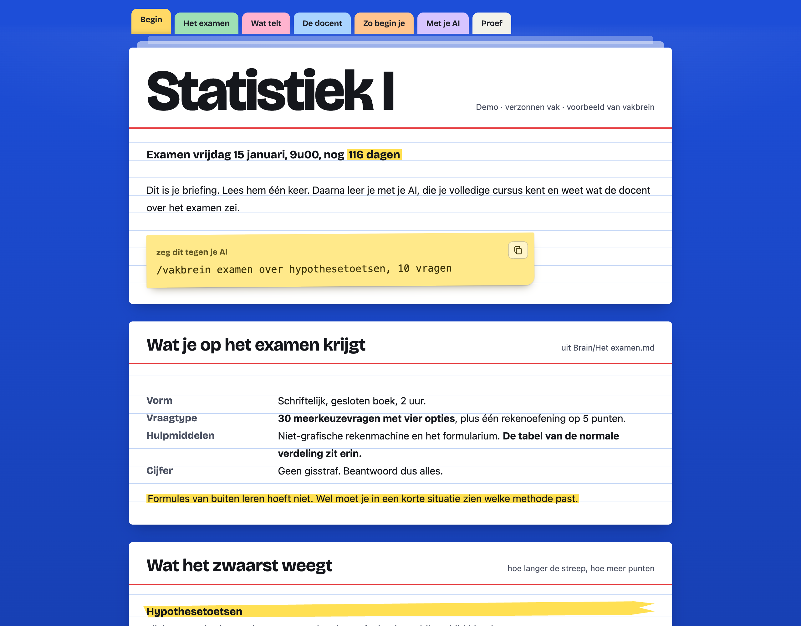
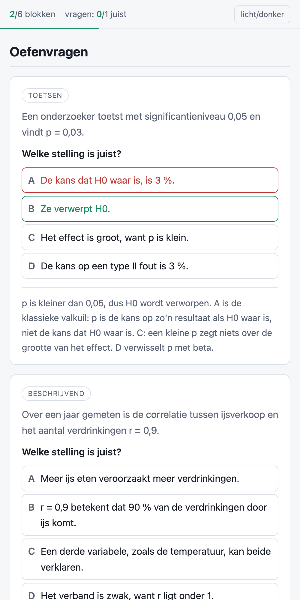

<p align="center">
  
</p>

<p align="center">
  <a href="https://luka-yugen.github.io/vakbrein/"><b>Live demo</b></a> ·
  <a href="#installeren">Installeren</a> ·
  <a href="#gebruiken">Gebruiken</a> ·
  <a href="SKILL.md">SKILL.md</a>
</p>

<p align="center">
  
  
  
</p>

Een skill voor je AI-assistent die van al je materiaal voor één vak een studiebrein maakt.
Je zet slides, lestranscripties, samenvattingen, oefeningen en oude examens in een map. De AI
leest alles, bouwt er een gelinkte wiki van, en houdt die bij als er materiaal bijkomt.
Je hoeft niet uit te leggen hoe. Dat staat in de skill.

De methode is die van Andrej Karpathy: [LLM Wiki](https://gist.github.com/karpathy/442a6bf555914893e9891c11519de94f).
Ruwe bronnen die niemand aanraakt, een wiki die de AI schrijft, en een schema met de regels.

## Hoe het werkt

<p align="center">
  
</p>

De skill stelt eerst één ronde vragen: welk vak, welke examenvorm, wanneer, wat mag mee, en
welke samenvattingen van anderen komen. Bij elke vraag doet hij een voorstel op basis van je
materiaal, dus meestal is het doorklikken.

Daarna bouwt hij het brein bron per bron, en logt hij wat klaar is. Stopt een sessie
halverwege, dan gaat de volgende verder waar het stopte.

De structuur hangt af van het soort vak. Bij een theorievak zijn de begrippen de centrale
pagina's. Bij een rekenvak zijn dat de oefeningen, met de methode stap voor stap en de
uitkomst om jezelf te controleren.

## Wat je krijgt

```
Statistiek I/
├── AGENTS.md              instructies voor elke AI (Codex, Cursor en andere)
├── CLAUDE.md              één regel: @AGENTS.md
├── examenstof.html        je studiepagina
├── 00 Bronnen/            je materiaal, onaangeroerd
│   └── _tekst/            alles omgezet naar tekst
├── _tools/                de scripts, zodat het brein ook zonder deze skill werkt
└── Brain/
    ├── SCHEMA.md          de regels voor ingest, nakijken en examen
    ├── index.md           catalogus
    ├── log.md             tijdlijn
    ├── Het examen.md
    ├── Examensignalen.md  alles wat de docent over het examen zei
    ├── Lessen/            één notitie per college
    ├── Concepts/          begrippen en methodes
    ├── Oefeningen/        bij rekenvakken
    ├── Entities/          wetten, auteurs, modellen, bij theorievakken
    └── Topics/            de delen van de cursus
```

De map opent als vault in [Obsidian](https://obsidian.md), met de grafiek van alle links.

## De studiepagina

`/vakbrein studielaag` maakt een briefing uit het brein. Je leest hem één keer aan het begin:
wat er op het examen komt, wat het zwaarst weegt, hoe de docent vragen stelt, hoe je begint,
en de zinnen die je tegen je AI zegt, klaar om te kopiëren. Daarna leer je in de chat.

De pagina is een kaartenbak: gelijnde systeemkaarten, tabbladen als navigatie, markeerstift
voor het gewicht, post-its voor de opdrachten en proefkaarten die je omdraait. Werkt offline,
op laptop en gsm, in licht en donker, en is printbaar.

<p align="center">
  
  &nbsp;
  
</p>

<p align="center"><a href="https://luka-yugen.github.io/vakbrein/">Probeer de demo</a>. Vak en inhoud zijn verzonnen.</p>

## Installeren

Kopieer deze map naar de skills-map van je AI-tool:

```bash
git clone https://github.com/luka-yugen/vakbrein ~/.claude/skills/vakbrein
```

Dat is de plek voor Claude Code. Leest je tool ook skills met een `SKILL.md`, zet de map in
de skills-map uit hun documentatie. Heeft je tool geen skills, open dan je vakmap, geef de
AI `SKILL.md` en zeg "volg dit bestand".

Nodig: Python 3.9 of nieuwer. Voor pdf's `pip install pypdf` of poppler (`pdftotext`). Voor
notities uit Kami-pdf's `pip install pymupdf`. Voor oude .ppt, .doc en .xls LibreOffice.

Controleer of alles werkt:

```bash
cd ~/.claude/skills/vakbrein
python3 scripts/extract.py --selftest
python3 scripts/notities.py --selftest
python3 scripts/nakijken.py --selftest
```

## Gebruiken

1. Maak een map voor het vak en zet al je materiaal in `00 Bronnen/`.
2. Open die map in je AI-tool en zeg `/vakbrein nieuw`, of "maak een brein voor dit vak".
3. Beantwoord de vragenronde.

| commando | wat er gebeurt |
|---|---|
| `/vakbrein nieuw` | het brein bouwen uit alles in `00 Bronnen/` |
| `/vakbrein ingest <bestand>` | een nieuwe les, slides of een oud examen verwerken |
| `/vakbrein nakijken` | zoeken naar gaten, tegenspraak en dode links |
| `/vakbrein examen` | oefenexamen in de echte examenvorm, je fouten worden bijgehouden |
| `/vakbrein studielaag` | de briefing `examenstof.html` maken of bijwerken |
| een gewone vraag | antwoord uit het brein, met links naar de pagina's |

In een tool zonder deze skill zeg je het in gewone woorden. De `AGENTS.md` van het brein
legt de AI uit wat "nieuw materiaal", "kijk het brein na" en "examen" betekenen.

## Waar de skill op let

Transcripties van lesopnames bevatten fouten in namen, vaktermen en getallen. De skill
neemt er nooit een naam, getal of paginanummer uit over zonder het tegen de slides te leggen.

Bij tegenspraak gaat de docent voor, dan de slides en de cursus, dan je eigen notities, en pas
als laatste samenvattingen van anderen. Oplossingen van andere studenten rekent hij zelf na.

Wat je in Kami markeerde of noteerde weegt zwaar. Dat is meestal waar de docent de nadruk
legde. `notities.py` haalt het per pagina uit de geëxporteerde pdf.

Hij maakt nooit iets publiek. Git wordt aangeboden, niet opgedrongen, en een brein hoort in
een privé-repo: er staat materiaal van je docent in.

## Licentie

MIT. Gemaakt voor studenten, doe ermee wat je wil. Het lettertype Bricolage Grotesque in de
studiepagina valt onder de SIL Open Font License, zie `assets/fonts/OFL.txt`.
